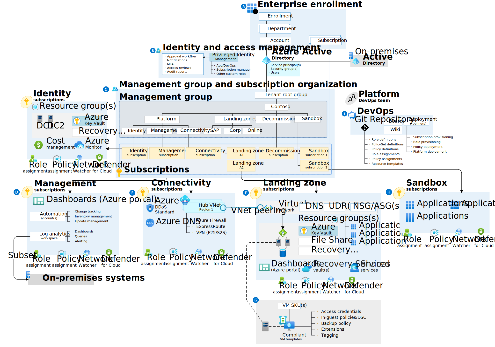

# List of Common Links

Here is a set of links  that will help overall.

https://esi.microsoft.com

https://learn.microsoft.com/en-us/certifications/exams/az-104

https://learn.microsoft.com/en-us/certifications/exams/az-305

https://learn.microsoft.com/en-us/training/paths/az-104-administrator-prerequisites/

Main Instruction File: https://github.com/Commochief/AZ-104-MicrosoftAzureAdministrator/blob/master/Instructions/Labs/AZ-104-Capstone_Exercise.md
 
Lab Files (for example only): https://github.com/Commochief/AZ-104-MicrosoftAzureAdministrator/tree/master/Allfiles/Labs/Capstone

Azure Architecture Center – Has a ton of reference architectures. Some examples for starters (hint…hint for AZ-305)

[Hub-spoke network topology in Azure - Azure Reference Architectures | Microsoft Docs](https://learn.microsoft.com/en-us/azure/architecture/reference-architectures/hybrid-networking/hub-spoke?tabs=cli)

[Implement a secure hybrid network - Azure Architecture Center | Microsoft Docs](https://learn.microsoft.com/en-us/azure/architecture/reference-architectures/dmz/secure-vnet-dmz?tabs=portal)

[Secure and govern workloads with network level segmentation - Azure Reference Architectures | Microsoft Docs](https://learn.microsoft.com/en-us/azure/architecture/reference-architectures/hybrid-networking/network-level-segmentation)

Secure Azure Cloud Architecture
https://learn.microsoft.com/en-us/azure/azure-government/compliance/secure-azure-computing-architecture

Azure Isolation Guidance
https://learn.microsoft.com/en-us/azure/azure-government/azure-secure-isolation-guidance

Azure FedRAMP Audit Scope by Service
https://learn.microsoft.com/en-us/azure/azure-government/compliance/azure-services-in-fedramp-auditscope?branch=pr-en-us-76518

AzureAD Security and Best Practices
https://docs.microsoft.com/en-us/azure/active-directory/fundamentals/active-directory-deployment-checklist-p2
https://docs.microsoft.com/en-us/azure/security/fundamentals/identity-management-best-practices

Azure Private Endpoint DNS:
https://learn.microsoft.com/en-us/azure/private-link/private-endpoint-dns

Azure MTU Info:
https://learn.microsoft.com/en-us/azure/virtual-network/virtual-network-tcpip-performance-tuning

Azure Sentinel To Go blog articles:
https://techcommunity.microsoft.com/t5/microsoft-sentinel-blog/azure-sentinel-to-go-part1-a-lab-w-prerecorded-data-amp-a-custom/ba-p/1260191

https://techcommunity.microsoft.com/t5/microsoft-sentinel-blog/azure-sentinel-to-go-part2-integrating-a-basic-windows-lab-via/ba-p/1742165

AzureAD Security and Best Practices
https://docs.microsoft.com/en-us/azure/active-directory/fundamentals/active-directory-deployment-checklist-p2
https://docs.microsoft.com/en-us/azure/security/fundamentals/identity-management-best-practices

Resource Naming Guidance/Tagging Guidance: 
https://docs.microsoft.com/en-us/azure/cloud-adoption-framework/ready/azure-best-practices/resource-naming

Here is the link to the CAF (Cloud Adoption Framework). One thing to remember is the CAF is written with commercial in mind not specifically DoD (the MLZ is the formal DoD specific landing zone construct) but the information in the CAF is invaluable for planning and understanding.
https://docs.microsoft.com/en-us/azure/cloud-adoption-framework/ready/landing-zone/
I use this image a lot to help breakdown areas of responsibility and control:

Subscription naming also becomes important which is why we provided a naming standard which is adapted directly from the CAF Naming Guidance.
https://docs.microsoft.com/en-us/azure/cloud-adoption-framework/ready/azure-best-practices/resource-naming
